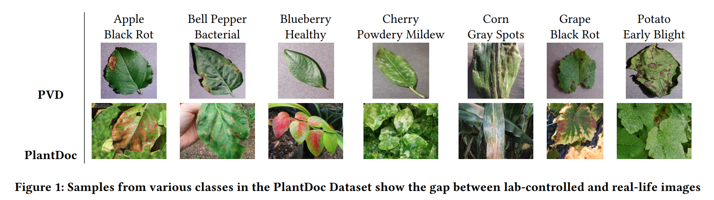

# PlantDoc: A Dataset for Visual Plant Disease Detection

This repository contains the Cropped-PlantDoc dataset used for benchmarking classification models in the paper titled "PlantDoc: A Dataset for Visual Plant Disease Detection" which was accepted in the Research Track at ACM India Joint International Conference on Data Science and Management of Data (CoDS-COMAD 2020).

While the Object-Detection dataset can accessed through the following [link](https://github.com/pratikkayal/PlantDoc-Object-Detection-Dataset).



## Abstract
India loses 35% of the annual crop yield due to plant diseases. Early detection of plant diseases remains difficult due to the lack of lab infrastructure and expertise. In this paper, we explore the possibility of computer vision approaches for scalable and early plant disease detection. The lack of availability of sufficiently large-scale non-lab data set remains a major challenge for enabling vision based plant disease detection. Against this background, we present PlantDoc: a dataset for visual plant disease detection. Our dataset contains 2,598 data points in total across 13 plant species and up to 17 classes of diseases, involving approximately 300 human hours of effort in annotating internet scraped images. To show the efficacy of our dataset, we learn 3 models for the task of plant disease classification. Our results show that modelling using our dataset can increase the classification accuracy by up to 31%. We believe that our dataset can help reduce the entry barrier of computer vision techniques in plant disease detection.

## Paper 
For full paper, refer [Arxiv](https://arxiv.org/abs/1911.10317) and [ACM](https://dl.acm.org/doi/10.1145/3371158.3371196)

## Authors 
Davinder Singh*, Naman Jain*, Pranjali Jain*, Pratik Kayal*, Sudhakar Kumawat and Nipun Batra

## Bibtex
```
@inproceedings{10.1145/3371158.3371196,
author = {Singh, Davinder and Jain, Naman and Jain, Pranjali and Kayal, Pratik and Kumawat, Sudhakar and Batra, Nipun},
title = {PlantDoc: A Dataset for Visual Plant Disease Detection},
year = {2020},
isbn = {9781450377386},
publisher = {Association for Computing Machinery},
address = {New York, NY, USA},
url = {https://doi.org/10.1145/3371158.3371196},
doi = {10.1145/3371158.3371196},
booktitle = {Proceedings of the 7th ACM IKDD CoDS and 25th COMAD},
pages = {249–253},
numpages = {5},
keywords = {Deep Learning, Object Detection, Image Classification},
location = {Hyderabad, India},
series = {CoDS COMAD 2020}
}
```

## License
Creative Commons Attribution 4.0 International [Link](https://github.com/pratikkayal/PlantDoc-Dataset/blob/master/LICENSE.txt)
